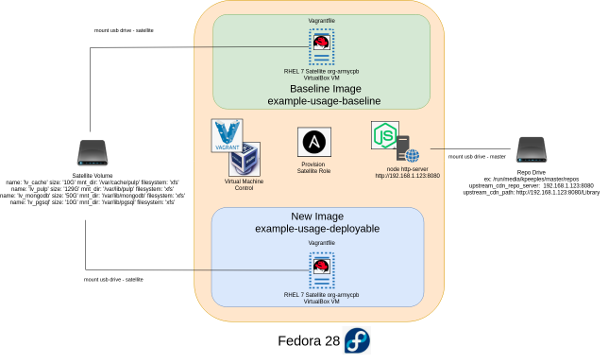

Role: satellite
===============

Disconnected Satellite Ansible Role.  The role structure is a standard role structure with the example-usage-baseline and example-usage-deployable folders which include Vagrantfile and playbook tested with Virtualbox.  This provides a create mode and deploy mode.

* example-usage-baseline --> example of creating the initial baseline including the baseline volumes (cache/pulp/mongodb/pgsql).  CREATE Mode.  
* example-usage-deployable --> example of creating a new deployed satellite with attaching the baseline images.  DEPLOY Mode.      



NOTE: for the example_usage to use the role create a link for both examples subfolders.  
```
# ln -s /home/kpeeples/example-usage-baseline/provisioning/roles/satellite  
# ln -s /home/kpeeples/cure-satellite/example-usage-deployable/provisioning/roles/satellite  
```

Steps to run:   
A.  Run CREATE Mode
  1. Build RHEL 7.x (latest) host  
  (Example-usage-baseline folder contains a Vagrantfile which is using generic/rhel7 box)  
  2. Register with Red Hat Customer Portal  
  (Disconected install not required as can be done manually)  
  3. Attach Satellite entitlement  
  (Example-usage-baseline contains a sample satellite_manifest.zip.  This can be replaced with a new manifest file from rhn)  
  4. Add a disk of 200GB  
  (Example-usage-baseline contains a sample SatelliteDisk.vdi in the Vagrantfile it creates and updates.  If it doesn't exist it is created.)  
  5. Add a disk of xTB for the repo served from a http server for disconnected operations     
  (use node http-server for a simple http server)  
  6. Adjust roles/satellite/vars/main.yml to fit your needs and environment   
  7. Run playbook  
  (example-usage contains a playbook used by Vagrant-Ansible provisioning)   

B. Run DEPLOY Mode
  1. Build RHEL 7.x (latest) host  
  (Example-usage-deployable folder contains a Vagrantfile which is using generic/rhel7 box)  
  2. Register with Red Hat Customer Portal  
  (Disconnected install not required as can be done manually)  
  3. Add a disk of 200GB  
  (Attach the SatelliteDisk.vdi from the CREATE mode or the Vagrantfile can attach the previously create and synced disk)   
  4. Add a disk of xTB for the repo served from a http server for disconnected operations     
  (use node http-server for a simple http server)  
  5. Adjust roles/satellite/vars/main.yml to fit your needs and environment   
  6. Run playbook  
  (example-usage-deployable contains a playbook used by Vagrant-Ansible provisioning)

Requirements  
------------  

Minimum System Requirements for roles (Verify these requirements):    
- Satellite 6.x  
- RHEL7.x (latest)  
- 30GB  OS drive [sda]  
- 200GB Content drive (500GB recommended) [sdb]  
- 4 CPU  
- 20GB memory  

Role Variables  
--------------  

1. defaults/main.yml Updates:
 - Review the file  

2. vars/main.yml Updates:  
 - Review the file  

3. Vault Usage:
A vault is used to manage admin passwords for this environment.  

 Vaulted values are stored inline in roles/satellite/vars/main.yml.  
 To recreate:  
  - ansible-vault encrypt_string Password123 --ask-vault-pass  

Dependencies  
------------  

1. Other roles dependencies:
 - Review the dependency file    

2. Downloading Manifest file:    
  a. Go to http://rhn.redhat.com.  
  b. Click "Subscription Allocations"  
  c. Select "New Subscription Allocation"  
  d. Enter name: "Satellite"  
  e. Select Type:  "6.4"  
  f. Click "Create"  
  g. Click "Subscriptions" and add the subscriptions and number of subscriptions to include in the manifest.  
  h. Select "Submit"   
  i. Click on "Export Manifest"  
  j. Name the file "satellite_manifest.zip" and download it to the roles/satellite/files/ folder  

Example Playbook
----------------

playbook.yml:

```
---
- name: Satellite Install
  hosts: satellitehost
  become: true
  vars:
    host_group: satellite
  roles:
    - satellite
```

License
-------

BSD

Author Information
------------------

CPB NERD Lab

References
----------
https://github.com/calliey1/Ansible_Satellite_Day1  
https://github.com/redhat-kejones/hattrick/tree/master/roles/rhel_satellite  
https://access.redhat.com/solutions/23016  
https://access.redhat.com/solutions/3176811  
https://access.redhat.com/solutions/7227/#http  
https://access.redhat.com/solutions/1355683  
https://github.com/juliovp01/ansible-satellite6-install/blob/master/tasks/configure_satellite.yml  
https://github.com/gonoph/satellite-install  
